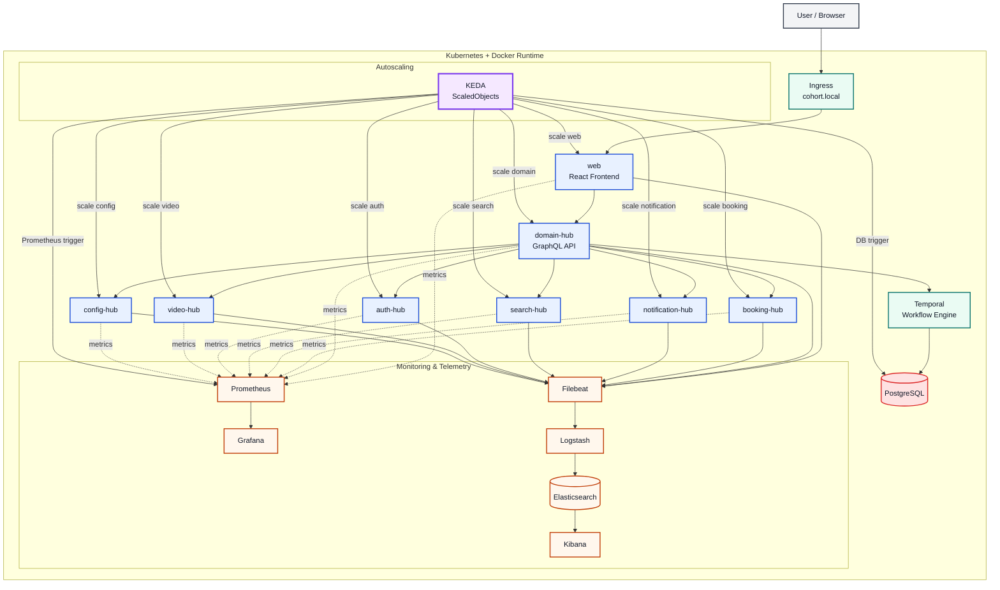

# Cohort

Cohort is a multi-service platform for scheduling, coordination, and workflow-driven operations. It follows a modular architecture where a central domain layer coordinates multiple specialized service hubs, while a frontend app delivers the user-facing experience.

The repository is structured as a monorepo and includes a Kubernetes deployment layout, Docker-based local orchestration, and observability tooling for metrics and logs.

## Architecture Overview



## Core Components

### 1. Frontend: web

Location: hubs/web

This is the main browser-facing application. It is exposed through the Kubernetes ingress and communicates primarily with the domain hub. The frontend is responsible for user flows, UI rendering, and calling orchestration APIs that trigger downstream services.

Responsibilities:

- UI renders for scheduling and platform interactions
- API calls to the domain layer
- User-facing dashboards and management experiences
- Aggregation of backend service responses

### 2. Domain orchestration layer: domain-hub

Location: hubs/domain-hub

This is the central coordination service. It acts as the primary API gateway for the platform and orchestrates calls to the specialized spoke services:

- booking-hub
- notification-hub
- search-hub
- auth-hub
- video-hub
- config-hub

It exposes GraphQL and HTTP endpoints and can also communicate with downstream services through gRPC ports. This is the main integration point for the application domain.

Responsibilities:

- Request aggregation and composition
- Service-to-service orchestration
- Domain logic and workflow coordination
- Health checks and platform readiness

### 3. Booking service: booking-hub

Location: hubs/booking-hub

Handles booking and scheduling workflows. It exposes its own HTTP and gRPC interface and participates in orchestration via the domain hub and workflow engine.

Responsibilities:

- Booking lifecycle management
- Scheduling operations
- Event-driven flows related to appointments or reservations

### 4. Notification service: notification-hub

Location: hubs/notification-hub

Responsible for customer and platform notifications, such as email, push, or messaging events triggered by business workflows.

Responsibilities:

- Dispatching notifications
- Event-driven messaging flows
- Integration with communication providers or downstream channels

### 5. Search service: search-hub

Location: hubs/search-hub

Provides searching and indexing capabilities. It is used by the domain layer for retrieval, discovery, and related query operations.

Responsibilities:

- Search indexing and retrieval
- Query handling for domain entities
- Content discovery and lookup operations

### 6. Authentication service: auth-hub

Location: hubs/auth-hub

Owns authentication and authorization concerns. It provides secure identity-related operations for the overall platform.

Responsibilities:

- User identity checks
- Auth flows
- Access control and session-related operations

### 7. Video service: video-hub

Location: hubs/video-hub

Handles video-related capabilities such as media processing, video endpoints, or streaming-specific backend tasks.

Responsibilities:

- Video/media APIs
- Media platform integration
- Video workflow support

### 8. Configuration service: configuration-hub

Location: hubs/configuration-hub

Provides centralized configuration and platform settings. This service allows the platform to manage runtime configuration in a decoupled way.

Responsibilities:

- System configuration access
- Feature flags and settings
- Environment-specific properties

### 9. Workflow engine: Temporal

Configured in k8s/base/temporal.yaml and used via the booking and orchestration layer.

Temporal is used for durable, long-running workflows and background task coordination. It helps manage asynchronous business processes that must be reliable and recoverable.

Responsibilities:

- Workflow orchestration
- Background task execution
- Event-driven process reliability
- Job retry and state tracking

### 10. Autoscaling: KEDA

Configured in k8s/base/keda/

KEDA (Kubernetes Event-Driven Autoscaling) sits on top of the cluster and automatically scales Kubernetes workloads based on Prometheus metrics and database-driven signals. The project defines ScaledObjects and TriggerAuthentication resources to scale the web, domain, booking, notification, search, auth, and video services based on throughput and queue-like conditions.

Responsibilities:

- Auto-scaling based on Prometheus metrics
- Database-driven scaling for workloads such as booking
- Dynamic handling of traffic spikes
- Better cost efficiency and elastic capacity management

### 11. Database: PostgreSQL

Configured in k8s/base/postgres.yaml

PostgreSQL is the persistence layer used by Temporal and other platform services. It stores workflow-related data and app state required by service operations.

Responsibilities:

- Durable data storage
- Workflow metadata persistence
- Application state storage

## Observability Stack

The platform includes a dedicated monitoring and telemetry layer to collect metrics, logs, and dashboards.

### Prometheus

Location: k8s/base/observability/prometheus.yaml

Prometheus scrapes metrics from the platform services over /metrics endpoints. It acts as the primary time-series metrics collector.

Responsibilities:

- Service metric collection
- Alerting and health evaluation
- Performance monitoring

### Grafana

Location: k8s/base/observability/grafana.yaml

Grafana is used for dashboards and visual monitoring of service health, system metrics, and platform trends.

Responsibilities:

- Metric dashboards
- Operational observability
- Visual analysis of service performance

### Filebeat

Configured in monitoring/filebeat/filebeat.yml and used as log collectors in the cluster environment.

Filebeat collects logs from services and forwards them to Logstash for processing.

Responsibilities:

- Log collection from containerized workloads
- Ship logs to the log pipeline

### Logstash

Location: k8s/base/observability/logstash.yaml

Logstash processes and transforms incoming logs before sending them to Elasticsearch.

Responsibilities:

- Log ingestion
- Log parsing and enrichment
- Routing events to storage

### Elasticsearch

Location: k8s/base/observability/elasticsearch.yaml

Elasticsearch stores log data and supports fast querying and indexing for observability workloads.

Responsibilities:

- Log storage
- Indexing and search
- Log analytics backend

### Kibana

Location: k8s/base/observability/kibana.yaml

Kibana is the visualization layer for Elasticsearch logs and data.

Responsibilities:

- Log exploration
- Search and dashboarding
- Operational debugging

## Kubernetes Deployment Layout

The repo contains Kubernetes manifests under:

- k8s/base
- k8s/overlays/dev
- k8s/overlays/stage
- k8s/overlays/prod

Key base resources include:

- ingress.yaml
- web-frontend.yaml
- hub-domain.yaml
- spoke-auth.yaml
- spoke-booking.yaml
- spoke-config.yaml
- spoke-notification.yaml
- spoke-search.yaml
- spoke-video.yaml
- temporal.yaml
- postgres.yaml
- observability/

This setup allows the application to run as a set of Deployments and Services in Kubernetes, with ingress providing the public entry point.

## Repository Structure

- hubs/ — application services and frontend modules
- design-system/ — shared UI component library
- k8s/ — Kubernetes manifests for base and overlays
- monitoring/ — observability configuration
- observability/ — shared observability utilities or code
- docker/ — Docker build config
- proto/ — protocol definitions
- scripts/ — startup and orchestration helpers

## Common Development Commands

From the root of the repo:

```bash
pnpm install
pnpm start
pnpm dev
pnpm build
pnpm typecheck
```

For Kubernetes-related deployment:

```bash
pnpm k8s:dev
pnpm k8s:stage
pnpm k8s:prod
## Helm 3 & Containerized Tooling (Zero Host Dependencies)

The repository provides a Docker-based utility container (`cohort-tools:latest`) so developers and CI systems can scaffold services, lint charts, and render templates without needing Helm, Kubectl, or Node locally installed:

```bash
# Scaffold a new service (generates TypeScript hub, Dockerfile, and Helm 3 chart)
./cohort-tools.sh scaffold analytics-hub 8009
# or: pnpm docker:scaffold analytics-hub 8009

# Lint all package and infrastructure Helm 3 charts
./cohort-tools.sh helm:lint
# or: pnpm docker:helm:lint

# Render manifests for dev-eu-west1, stage, or prod environments
./cohort-tools.sh helm:template:dev
./cohort-tools.sh helm:template:stage
./cohort-tools.sh helm:template:prod
```

## Minikube Multi-Environment Cluster

To test and run the full platform locally across environments (`dev-eu-west1`, `stage`, and `prod`) on a real Kubernetes cluster with Ingress and Metrics Server:

```bash
# 1. Start Minikube with Ingress & Metrics Server
./scripts/minikube.sh start
# or: pnpm minikube:start

# 2. Build service Docker images directly into Minikube's daemon
./scripts/minikube.sh build-images
# or: pnpm minikube:build

# 3. Deploy to the desired environment
./scripts/minikube.sh deploy dev     # deploys to cohort-dev-eu-west1 namespace
./scripts/minikube.sh deploy stage   # deploys to cohort-stage namespace
./scripts/minikube.sh deploy prod    # deploys to cohort-prod namespace (with HPA & PDB)

# 4. Inspect status across pods, services, ingresses, and HPAs
./scripts/minikube.sh status all

# 5. Route local ingress traffic (in a separate terminal)
./scripts/minikube.sh tunnel

# 6. View required /etc/hosts domain mappings
./scripts/minikube.sh hosts

# 7. Clean up an environment
./scripts/minikube.sh clean dev
```

## Package-Owned Azure Terraform Infrastructure (With Versioning)

Every service in the monorepo owns its own dedicated Azure Terraform configuration under `hubs/<service>/terraform/`. This design enables cloud infrastructure to evolve alongside service versions independently (for example, `video-hub` v0.0.1 using filesystem storage vs. v0.0.2 provisioning an Azure Storage Account and Blob Container).

```bash
# Validate Terraform configurations across all 10 packages
./cohort-tools.sh tf:validate:all
# or: pnpm tf:validate:all

# Run Terraform commands for a specific package
./cohort-tools.sh tf video-hub validate
./cohort-tools.sh tf video-hub plan
./cohort-tools.sh tf domain-hub plan

# When scaffolding a new service, Terraform configs are created automatically:
./cohort-tools.sh scaffold analytics-hub 8009
```

## Summary

Cohort is designed as a modular, service-oriented platform where:

- the web app provides the user interface,
- the domain hub coordinates business processes,
- specialized spokes handle core functional domains,
- Temporal manages workflow execution,
- PostgreSQL stores platform state,
- and Prometheus, Grafana, Elasticsearch, Logstash, and Kibana provide full telemetry and observability.

This architecture makes the system extensible, scalable, and operationally observable while keeping responsibilities separated across focused service boundaries.
